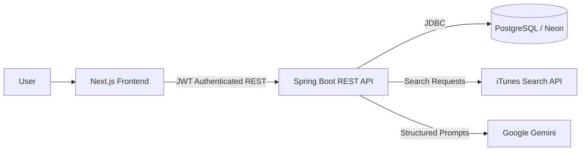

# Music Catalog Insights Platform

A full-stack, AI-powered web application that allows users to search the public iTunes music catalog, curate a personal library of albums, explore detailed library analytics, and receive personalized AI-generated music recommendations.

## Live Application

- **Frontend (Vercel)**: https://music-catalog-insights-mauve.vercel.app
- **Backend (Render)**: https://music-catalog-insights-1.onrender.com

---

## Overview

This project was built for a 3-day Full-Stack + AI take-home assignment. It serves as a complete demonstration of modern full-stack web development, incorporating rigorous backend API design, a responsive and interactive frontend, robust database modeling, and seamless third-party AI and external catalog integration.

## Why Albums?

The assignment requires focusing on either Albums, Songs, or Artists. 

**Albums** were selected as the primary focus because they provide the richest set of structured metadata. An album naturally aggregates an artist, a specific genre, a release date, artwork, and a track count into a single cohesive entity. This structure is highly conducive to meaningful data aggregation for the Analytics Dashboard (e.g., releases over time, genre distribution) and provides dense contextual information that enables the AI model to generate highly personalized listening profiles.

---

## Features

- **iTunes Catalog Search:** Live debounced searches against the public iTunes API.
- **Library Management:** Add, update, and remove albums with personal notes and ratings.
- **Analytics Dashboard:** Four detailed data visualization charts providing insights into the user's curated collection.
- **AI-Powered Insights:** Personalized music recommendations and listening trends generated by Google Gemini.
- **Secure Authentication:** JWT-based user registration and login.
- **Responsive Design:** A polished, mobile-friendly interface with loading skeletons and empty states.

---

## Architecture



---

## Tech Stack

### Frontend
- **Framework:** Next.js 15 (App Router), React 19
- **Language:** TypeScript
- **Styling:** Tailwind CSS, Lucide React
- **Data Fetching:** TanStack Query, Axios
- **Forms & Validation:** React Hook Form, Zod
- **Visualizations:** Recharts

### Backend
- **Framework:** Java 21, Spring Boot 3.5.0
- **Security:** Spring Security, JWT (jjwt)
- **Data Access:** Spring Data JPA, Flyway Migrations
- **Caching:** Caffeine
- **Build Tool:** Maven

### Database & External Services
- **Database:** PostgreSQL (Hosted on Neon)
- **Catalog Integration:** iTunes Search API
- **AI Provider:** Google Gemini API (gemini-2.5-flash)

---

## Database Design

**PostgreSQL** was chosen for its strict enforcement of structured relational data, constraints, and data integrity. It effortlessly handles the necessary unique constraints (preventing duplicate albums per user), cascading deletes, and complex aggregation queries required by the Analytics Dashboard.

### `saved_albums` Table

| Column | Type | Purpose |
|--------|------|---------|
| `id` | UUID | Primary Key |
| `user_id` | UUID | Foreign Key linking the album to its owner |
| `apple_catalog_id` | VARCHAR | Unique catalog identifier from iTunes |
| `title`, `artist_name`, `genre` | VARCHAR | Core album metadata |
| `release_date`, `track_count` | VARCHAR/INT | Additional album details |
| `artwork_url` | VARCHAR | High-res cover art URL |
| `user_rating`, `user_notes` | INT/VARCHAR | User-specific curation data |
| `created_at`, `updated_at` | TIMESTAMP | Auditing timestamps |

*Note: Only user-owned application data and curation metadata are persisted in the database. The external iTunes catalog is not copied or mirrored; it is queried live.*

---

## REST API

All API requests are routed through `/api/v1` and are protected via stateless JWT authentication (except registration and login).

| Method | Endpoint | Auth Required | Description |
|--------|----------|---------------|-------------|
| POST | `/api/v1/auth/register` | No | Register a new user |
| POST | `/api/v1/auth/login` | No | Authenticate and retrieve JWT |
| GET | `/api/v1/search` | Yes | Proxy search to iTunes API |
| GET | `/api/v1/library` | Yes | Retrieve the user's saved albums |
| POST | `/api/v1/library` | Yes | Save a new album to the library |
| PUT | `/api/v1/library/{id}` | Yes | Update notes/rating for an album |
| DELETE | `/api/v1/library/{id}` | Yes | Remove an album from the library |
| GET | `/api/v1/analytics/overview` | Yes | Aggregate high-level library stats |
| GET | `/api/v1/analytics/genres` | Yes | Genre distribution data |
| GET | `/api/v1/analytics/artists` | Yes | Top artists frequency data |
| GET | `/api/v1/analytics/releases` | Yes | Albums grouped by release year |
| GET | `/api/v1/analytics/ratings` | Yes | User rating distribution data |
| GET | `/api/v1/ai/recommendations` | Yes | Generate Gemini AI insights |
| GET | `/api/v1/activity/recent` | Yes | Retrieve recent user activity/searches |

---

## Analytics Dashboard

The platform satisfies the analytics requirements by implementing four distinct visualizations (powered by Recharts):

1. **Genre Distribution (Pie/Donut Chart):** Visualizes the composition of the user's library by genre to understand their musical tastes.
2. **Top Artists (Horizontal Bar Chart):** Ranks the most frequently saved artists in the collection.
3. **Releases by Year (Histogram/Line Chart):** Maps album release dates chronologically to show the era/decade distribution of the user's music.
4. **Rating Distribution (Bar Chart):** Displays how the user has historically rated their saved albums.

---

## AI-Powered Insights

The AI integration utilizes the **Google Gemini API** (model: `gemini-2.5-flash`). 

**Flow:**
1. The backend aggregates the user's saved albums, top genres, and ratings.
2. This structured data is fed into a heavily engineered prompt sent to the Gemini API.
3. The model returns a structured JSON payload which is mapped to a `RecommendationResponseDTO`.

**Features Delivered:**
- Distinct Listening Personality analysis.
- Detailed listening trends and interesting observations based on chronological and genre diversity.
- Specific album recommendations outside the user's current library but tailored to their unique taste.

---

## Beyond the Core Requirements

- **Unit Testing:** Comprehensive backend test coverage (19 automated tests) using JUnit 5 and Mockito.
- **Caching:** The backend uses Spring Cache (Caffeine) to cache identical external iTunes search queries, reducing latency and rate-limiting risks. The frontend utilizes TanStack Query for robust client-side caching and state synchronization.
- **Debounced Search:** The frontend search input implements debouncing to minimize unnecessary network requests while typing.

---

## Security

- **Authentication:** Stateless JSON Web Tokens (JWT).
- **Password Security:** BCrypt password hashing.
- **Data Isolation:** All library queries enforce strict `user_id` ownership checks.
- **Configuration:** Environment-based secrets (no hardcoded keys).

---

## Local Development

### Prerequisites
- Java 21
- Maven
- Node.js & npm
- PostgreSQL (Local or Neon URL)

### Backend Setup

1. Navigate to the backend directory:
   ```bash
   cd backend
   ```
2. Create a `.env` file or export the following environment variables:
   ```bash
   DB_URL=jdbc:postgresql://localhost:5432/music_catalog
   DB_USERNAME=postgres
   DB_PASSWORD=your_password
   JWT_SECRET=your_secure_secret_key_here
   GEMINI_API_KEY=your_gemini_api_key
   CORS_ALLOWED_ORIGINS=http://localhost:3000
   ```
3. Run the application:
   ```bash
   mvn spring-boot:run
   ```

### Frontend Setup

1. Navigate to the frontend directory:
   ```bash
   cd frontend
   ```
2. Install dependencies:
   ```bash
   npm install
   ```
3. Set the environment variables in a `.env.local` file:
   ```bash
   NEXT_PUBLIC_API_URL=http://localhost:8080/api/v1
   ```
4. Start the development server:
   ```bash
   npm run dev
   ```

---

## Testing

The backend includes a suite of automated unit and integration tests. To run them locally:

```bash
cd backend
mvn test
```

*Status: 19 automated backend tests.*

---

## Deployment

- **Frontend:** Deployed to Vercel. Next.js App Router provides optimized static and dynamic rendering.
- **Backend:** Deployed to Render as a standalone Spring Boot JAR.
- **Database:** Serverless PostgreSQL hosted on Neon.

All secrets and environment variables are securely injected via the respective hosting platform's configuration settings.

---

## Trade-offs & Design Decisions

1. **Albums vs. Songs/Artists:** Chose albums to maximize structural metadata (release dates, track counts, genres) which dramatically improved the quality of analytics and AI insights.
2. **PostgreSQL vs. NoSQL:** While a document database could easily store JSON responses from iTunes, PostgreSQL was chosen for data integrity, unique constraints, and the ability to easily perform complex aggregations for the analytics dashboard.
3. **Backend as a Proxy for iTunes:** The frontend routes searches through the Spring Boot backend rather than calling iTunes directly. This allows the backend to cache external responses, rate-limit, and sanitize data before it hits the client.
4. **Gemini 2.5 Flash:** Chosen for its exceptional speed-to-cost ratio, ensuring the AI insights load quickly enough to maintain a snappy user experience.

---

## Project Structure

```text
music-catalog-insights/
├── backend/
│   ├── src/main/java/com/musiccatalog/
│   └── pom.xml
├── frontend/
│   ├── src/app/
│   ├── src/features/
│   └── package.json
└── README.md
```

---

## Assignment Compliance Summary

| Requirement | Implementation | Status |
|-------------|----------------|--------|
| Album focus | Yes, structured entity | ✅ Complete |
| Database schema | PostgreSQL, Flyway, relational modeling | ✅ Complete |
| iTunes search | Backend proxy to iTunes public API | ✅ Complete |
| Library CRUD | Add, update notes/ratings, delete | ✅ Complete |
| JWT authentication | Spring Security, JJWT | ✅ Complete |
| Validation | Bean Validation, Zod | ✅ Complete |
| Centralized error handling | @RestControllerAdvice | ✅ Complete |
| Search UI | Next.js debounced search | ✅ Complete |
| Library UI | Grid layout, curated management | ✅ Complete |
| Responsive/states | Tailwind, Skeletons, empty states | ✅ Complete |
| 4+ analytics charts | Recharts (Genres, Artists, Releases, Ratings) | ✅ Complete |
| AI feature | Gemini personalized insights | ✅ Complete |
| Deployment | Vercel (FE), Render (BE), Neon (DB) | ✅ Complete |
| README | Professional documentation | ✅ Complete |
| Unit tests | 19 automated tests (JUnit/Mockito) | ✅ Complete |
| Debounced search | Frontend React custom hook/state | ✅ Complete |
| Caching | Spring Caffeine + TanStack Query | ✅ Complete |

---

## License

This project is licensed under the MIT License.
